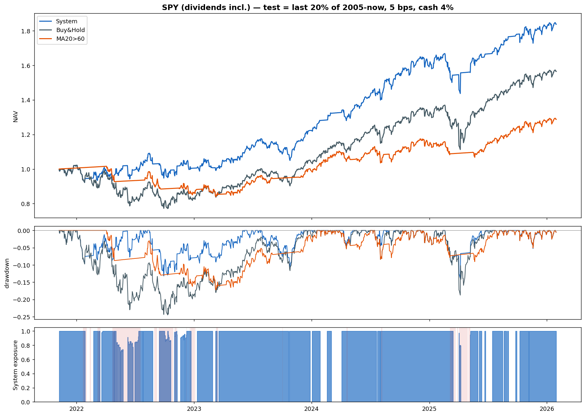
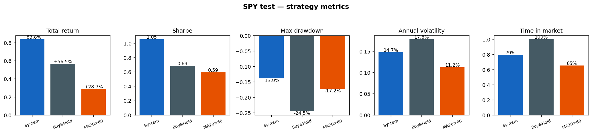

<div align="center">

# Alpha Timing

### 市场状态感知的量化择时系统

*用一个市场状态分类器,把每个交易日路由到对应的收益预测专家 ——*
*以牛市里的小拖累,换熊市里的大保护。*

[English](README.md) | **中文文档**


Xu Shuyao · NUS · 2026 · [LinkedIn](https://www.linkedin.com/in/shuyao-xu-4841103a7)

</div>

---

## 概述

**Alpha Timing** 回答一个问题:*如果模型能判断市场当下处于什么状态,能不能据此比"一直满仓"更聪明地决定仓位?*

系统分三级。**状态分类器**每天识别市场处于牛市/熊市/震荡/危机;根据这个状态,**四个专家模型**之一预测近期收益;**决策层**把预测转成 0(空仓)到 1(满仓)之间的仓位,在避险状态下偏保守,并带一个自动的波动刹车。

```
                       ┌──────────────────────────────┐
 每日特征 ────────────►│ 状态分类器 (随机森林)         │
 (仅用过去数据)        │ 牛市 / 熊市 / 震荡 / 危机     │
                       └───────────────┬──────────────┘
                                       │ 路由到
                       ┌───────────────▼──────────────┐
                       │ 4 个状态专家 (梯度提升树)     │
                       │ 预测未来 5 日超额收益         │
                       └───────────────┬──────────────┘
                                       │ ŷ
                       ┌───────────────▼──────────────┐
                       │ 双门槛滞后规则               │
                       │ (熊市/危机偏保守) + 波动目标  │
                       └───────────────┬──────────────┘
                                       ▼
                              仓位 ∈ [0, 1]
```

**一句话结果:** 在 SPY 跨标的测试(2021年11月 → 2026,含股息,5bps 成本)上,系统 **夏普 1.05,对照买入持有 0.69**;**最大回撤 −14%,对照 −25%**。

---

## 实时看板

一个流动的看板对六只流动性标的 —— **SPY、QQQ、AAPL、NVDA、MSFT、GOOGL** —— 各自跑一遍完整流程,分别展示当天的市场状态、未来5日预测与买卖建议。界面主色调跟随所选标的的市场状态。GitHub Actions 每个交易日刷新一次信号(模型基于每日收盘):价格来自 Yahoo,2年/10年国债收益率来自美国财政部,VIX 实时。

**▶ [查看实时看板](https://davidxu277.github.io/alpha-timing/)** · *仅供研究,非投资建议。*

```bash
python build_models.py            # 一次性:把训练好的模型缓存到本地(可选)
python docs/update_signals.py     # 拉取实时数据 + 写入 docs/data/signals.json
# 然后打开 docs/index.html(例如在 docs/ 里运行 `python -m http.server`)
```

---

## 工作原理(逐步讲)

### 1 · 状态分类器

一个 `RandomForestClassifier`(300 棵树,平衡类别权重),用 **16 个过去特征**把每天判成四种状态之一:动量、均线偏离、实现波动、价格位置(12 个技术因子),加 VIX、联邦基金利率、失业率、10年–2年期利差(4 个宏观量)。

- **判断当下,不是预测未来。** 所有特征截止到第 *t* 天、标签也是第 *t* 天的状态 —— 它回答"现在是什么市",不是"接下来会怎样"。
- 样本外准确率约 **88%**;模型独立复现了"趋势 + 波动"这套教科书式的市场状态刻画,与状态切换文献一致(Hamilton 1989; Ang & Bekaert 2002)。分类器的单独研究见姊妹仓库 [regime-classifier](https://github.com/davidxu277/regime-classifier)。

### 2 · 状态专家

四个 `HistGradientBoostingRegressor`,一种状态一个。每个**只用自己状态的日子**训练,预测**同一个目标:未来 5 天相对现金的超额收益**,输入是 12 个波动率归一化的技术因子。

- **专业化来自数据,不来自目标。** 牛市专家只见过牛市日,危机专家只见过危机日 —— 于是它们对同一个信号学出相反的反应(急跌在牛市里是低吸机会,在危机里是不能接的飞刀)。一个统一模型会把这些矛盾规律平均掉,四个专家则各自保住。
- **一次预测到底是什么。** 梯度提升树是约 300 棵浅层 if-else 树的叠加,每片叶子存的是*落进这片叶子的历史日子、其未来收益的平均值*。预测 +0.35% 的字面含义是:*"在和今天最相似的历史日子里,之后 5 天平均跑赢现金 0.35%。"* 没有人为设定的公式 —— 模型就是把历史压缩成一张可查询的统计表。

### 3 · 决策层

专家的预测 ŷ 通过两个机制变成仓位(下面作为亮点详述):**双门槛滞后规则**(何时进出)和**波动目标叠加**(投多少)。

**全程因果:** 特征只用过去;部署时状态永远用分类器的*预测*(绝不用标签);第 *t* 天收盘决定的仓位赚 *t*→*t+1* 的收益;每次换仓付 5bps;闲置资金吃利息。

---

## 亮点 1 · 波动目标仓位

一个风险*恒温器*。系统固定的不是"投多少钱",而是"冒多大险":

```
仓位 = min(1, 25% / 当前波动)
```

*当前波动* = 最近 20 个日收益的标准差、年化(×√252)。逻辑只需一步代数 —— 组合风险 ≈ 仓位 × 标的波动,要把风险恒定在 25%,就令 `仓位 = 25% / 波动`。`min(1, …)` 封顶在 100%(不加杠杆)。

| 市场状态 | 当前波动 | 仓位 `min(1, 25%/波动)` |
|---|---|---|
| 平静牛市 | 15% | 100%(封顶) |
| 正常 | 30% | 83% |
| 动荡 | 50% | 50% |
| 崩盘 | 80% | 31% |

市场越疯狂,每一块钱携带的风险越大,系统就自动少投。它连续、自动、**不需要预测** —— 2020 年 3 月波动飙升那周,仓位在任何模型报警之前就已经在往下走了。

---

## 亮点 2 · 双门槛滞后

仓位变动要穿越一条**缓冲带**,而不是一条线 —— 这吸收了低信号预测的日间抖动,让交易成本不至于把策略磨死。空仓时 ŷ 要越过**进场线**才买;持仓时 ŷ 要跌破**离场线**才卖;中间不动。

两对门槛是**按状态不对称**的 —— 而且这个不对称是*验证集网格搜索选出来的*,不是硬塞的:

| 状态组 | 进场线 | 离场线 | 行为 |
|---|---|---|---|
| **Risk-on**(牛市 / 震荡) | +0.1% | −0.3% | 易进难出 → **倾向持仓** |
| **Risk-off**(熊市 / 危机) | +0.3% | 0.0% | 要强信号才进,ŷ 一转负立刻离场 → **保守** |

熊市/危机里的"慢进快出"是回撤保护的结构性来源。优化器在网格里的对称候选之外选中了这个不对称形状,意味着**数据本身支持"顺着牛市、敬畏熊市"。**

---

## 亮点 3 · 状态分类器真的有必要吗?(消融)

一个合理的质疑:如果相似的特征日本就相似,分类器岂不是多余 —— 一个足够强的单模型不就能学会一切?我们把**分类器去掉**、在同一个 SPY 测试上重新测量:

| 变体 | 总收益 | 夏普 | 最大回撤 | 分类器角色 |
|---|---|---|---|---|
| **A · 完整系统**(4 专家 + 状态门槛) | **+83.8%** | **1.05** | −13.9% | 全用 |
| C · 单一统一模型 + 状态门槛 | +55.4% | 0.78 | −15.4% | 只用来设防御门槛 |
| B · 单一统一模型 + 单门槛 | +52.6% | 0.80 | −15.7% | 完全去掉 |
| 买入持有 | +56.5% | 0.69 | −24.5% | — |

去掉分类器,夏普从 **1.05 掉到约 0.80** —— 路由贡献了一大半的超额。它*不是*对同一批特征的重复分割,有两个原因:

1. **监督目标不同。** 分类器用*状态标签*训练,专家用*未来收益*训练。按"这是什么状态"切,和按"什么预示收益"切,划出的边界完全不同 —— 分类器注入了一种"市场状态"的概念,而纯收益预测在噪声里根本发现不了。
2. **低信噪比下的归纳偏置。** 就算单个深模型*理论上*能表示这个交互,在真实信号只有日噪声约 2% 的情形下它也*学不出来*。路由等于把这个结构免费塞给它。(无限数据的极限下单模型会吞掉一切 —— 两阶段架构挣饭吃,恰恰是因为我们活在有限、嘈杂的真实市场里。)

用 `python regime_trading.py --ablation` 复现。

---

## 结果 —— SPY 迁移测试

**测试协议:** SPY 复权收盘价(含股息)从 2005 年起,按时间切分,**测试 = 最后 20%(2021年11月 → 至今)**;5bps 成本,闲置现金 4%/年。**没有任何参数在 SPY 上调过** —— 模型全部来自 35 只股票的训练宇宙,所以这是一次纯粹的跨标的迁移。

| 策略 | 总收益 | 夏普 | 最大回撤 | 年化波动 | 在场时间 |
|---|---|---|---|---|---|
| **系统** | **+83.8%** | **1.05** | **−13.9%** | 14.7% | 79% |
| 买入持有 | +56.5% | 0.69 | −24.5% | 17.8% | 100% |
| MA20>60 | +28.7% | 0.59 | −17.2% | 11.2% | 65% |





底部面板是仓位:整个 2022 熊市里,分类器判定避险(红色底纹),系统进入现金;随后在 2023–2025 的复苏里基本满仓。

**逐年归因(系统 − 买入持有):**

| 年份 | 系统 | 买入持有 | 超额 |
|---|---|---|---|
| **2022** | **−1.6%** | **−19.0%** | **+17.4pp** |
| 2023 | +21.7% | +26.0% | −4.3pp |
| 2024 | +30.1% | +25.3% | +4.8pp |
| 2025 | +14.0% | +18.2% | −4.2pp |

超额来自躲开 2022 熊市;牛市年份大致互相抵消。这是设计在按预期工作,不是运气 —— 一个状态感知的配置器*本就应该*用少许上涨,换大量保护。

---

## 开发过程

最终架构是几个被淘汰版本的幸存者:

1. **因子 IC 扫描。** 建模前,在 39 只标的上做的信息系数研究显示:在 1–20 天尺度,所有趋势因子的 IC 都是*负的*(短期反转),恐慌因子(VIX 飙升)为正。它也校准了预期:中位 |IC| ≈ 0.02–0.06 —— 信号只有噪声的百分之几,这决定了之后的每个选择。
2. **强化学习,被放弃。** 第一版交易模型是每个状态一个 DQN。它结构性不稳:真实的"持仓 vs 空仓"边际只有日噪声的约 2%,价值估计被噪声主导,学出的策略在不同运行间翻转(同一种子下,600 集和 2500 集结论相反)。诊断:在这个信噪比下,基于价值的 RL 是错的工具。
3. **监督专家。** 用梯度提升回归器 —— 靠平均几万个样本而非试错 —— 替换 DQN 后,结果变得确定、可复现。
4. **v1 → v2 防御重构。** 第一版在温和窗口上按夏普调参,没学到防御(回撤 −35%,和买入持有一样)。v2 用状态不对称门槛、在含真实回调的窗口上按 Calmar 选参、加波动目标叠加,修好了这一点。
5. **消融实验。** 神谕路由证明分类器的*误差*代价很小;上面那个消融证明分类器本身贡献了大半超额。每个实验都为一个组件辩护。

---

## 设计取舍

- **超额是事件驱动的(n ≈ 2)。** 超额收益集中在少数几次正确的避险(2020、2022)。这是最诚实的核心局限,也是未来工作最该去化解的。
- **牛市年份夏普输给买入持有是结构性的,不是 bug。** 在平滑上涨里买入持有就是最优;任何会减仓的策略在那里都必须让出一些风险调整收益。正确的尺度是**整个周期**(夏普 1.05 vs 0.69),不是任何单一年份。
- **不做标签平滑。** 一个平滑碎标签的实验被否决:合并短片段需要知道*未来*的持续长度,而且会在大顶处系统性延迟状态翻转。所有去噪都放在因果的决策层。
- **宏观只经由分类器进入。** 专家只用技术因子(跨股票可比);宏观(VIX、利率)对某天所有股票相同,所以它服务于*状态*判断,而不是横截面的收益预测。

---

## 改进方向

- **更多熊市**(2008、2000)来检验保护是可复现的规律,还是 2022 的偶然 —— 鉴于 n ≈ 2 的依赖,这是性价比最高的下一步。
- **领先的跨资产信号**(信用利差、VIX 期限结构)来缩短分类器的滞后。
- **减少 2025 那种误报避险** —— 削减假警报是"纯赚",因为它不削弱真实熊市里的保护。
- **在专家里也试宏观因子**,以及用连续(多档)仓位替代二元进出。

---

## 数据

`stock_market_regimes_2000_2026.csv`(约 35 MB,已包含):Kaggle 上 Muhammad Afaq Bhatti 的 [Stock Market Regimes (2000–2026)](https://www.kaggle.com/datasets/mafaqbhatti/stock-market-regimes-20002026),Apache 2.0 —— 39 只美股标的的日频价格、状态标签和宏观数据。`regime_trading.py` 运行时会另外从 Yahoo 下载 SPY 复权价。

## 使用

```bash
pip install -r requirements.txt

python regime_trading.py             # 训练完整系统 + SPY 测试 + 出图
python regime_trading.py --ablation  # 复现分类器必要性的消融实验 (A/B/C)
```

整个系统就在单个文件 [regime_trading.py](regime_trading.py) 里。

## 局限

事件驱动的超额(n ≈ 2 次熊市);状态标签来自第三方(价格/波动定义);单一最终测试窗口;结果假设按日收盘价、5bps 成本执行。

## 许可

代码采用 [MIT License](LICENSE)。数据集为 Apache 2.0(见"数据")。

## 免责声明

仅供研究和教育用途。**非投资建议**;回测结果不代表未来表现。
